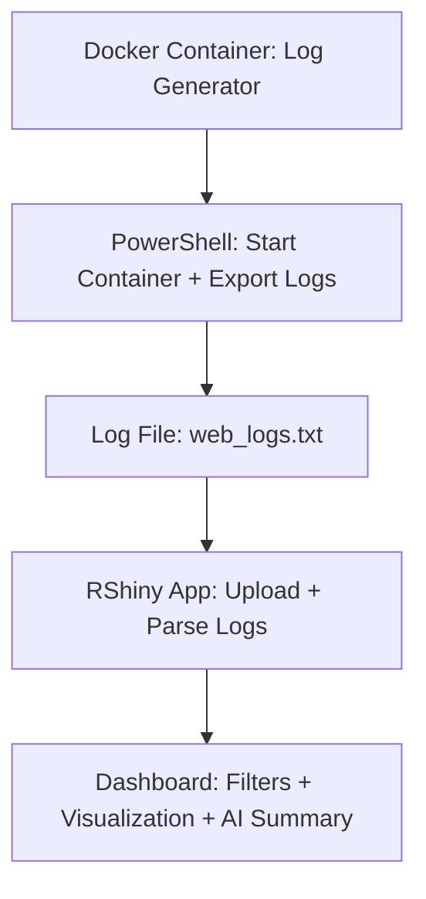

# 🐳 DockrIntel: AI-Powered Docker Log Insights via PowerShell + RShiny

> ✨ **Repo name suggestion:** `dockrintel-ai-logs`

---

## ✨ Summary

This project showcases how **Docker**, **PowerShell**, and **RShiny** can be creatively combined to build an intelligent, self-generated log analysis system. Everything you see in this repo was **ideated and built from scratch** to push the limits of **AI-driven system diagnostics** — without manually writing most of the code.

By imagining how **AI could design its own monitoring system**, I:

* Created Docker containers that simulate real-time log streams
* Used PowerShell to manage container lifecycles and log export
* Built a responsive, intelligent **RShiny dashboard** that parses, filters, and summarizes logs like a human analyst would

All of this was done by someone new to Docker and PowerShell, proving that modern development workflows can be demystified and democratized using AI and open tools.

---

## 🔗 Clickable Sections

* [App Map (Flowchart)](#-app-map-flowchart)

* [Tech Stack](#-tech-stack)

* [RShiny Installed Packages](#-rshiny-installed-packages)

* [What is Docker?](#-what-is-docker)

* [PowerShell + Docker Setup](#-powershell--docker-setup)

* [PowerShell Script](#-powershell-script)

* [Dockerfile](#-dockerfile)

* [run.sh - Log Generator](#-runsh---log-generator)

* [RShiny App Code](#-rshiny-app-code)

* [Fixing Encoding in Notepad++](#-fixing-encoding-in-notepad)

* [Why This Matters](#-why-this-matters)

* [Conclusion](#-conclusion)

---

## 🛠️ Tech Stack


---

## 📊 RShiny Installed Packages


---

## 🚀 What is Docker?

**Docker** is a container platform that lets you run lightweight, isolated environments for apps and services. Each container includes the app code and its dependencies — like a mini virtual machine.

This project uses Docker to:

* Simulate real-time system logs
* Keep log generation isolated and reproducible
* Interface cleanly with PowerShell and R

> Think of Docker containers as self-contained black boxes that you can turn on/off, inspect, and interact with — just like real system processes.

---

## 🛋️ PowerShell + Docker Setup

### Step 1: Install Docker Desktop

1. Download Docker from [https://www.docker.com/products/docker-desktop/](https://www.docker.com/products/docker-desktop/)
2. Follow the install instructions
3. Launch Docker Desktop and ensure it's running

### Step 2: Create Working Directory

```powershell
mkdir docker-log-demo
cd docker-log-demo
```

---

## 🗺️ App Map (Flowchart)



---

## 🔧 PowerShell Script

```powershell
notepad run.sh   # Paste the bash code below and save
notepad Dockerfile  # Paste Dockerfile contents below and save
```

Then build and run:

```powershell
docker build -t log-simulator .
docker run -d --name demo-web -e APP_NAME=web-app log-simulator
docker logs -f demo-web
```

Export logs:

```powershell
docker logs demo-web > web_logs.txt
```

---

## 📄 Dockerfile

```Dockerfile
FROM alpine:latest

COPY run.sh /run.sh
RUN chmod +x /run.sh

ENTRYPOINT ["/bin/sh", "/run.sh"]
```

---

## 📄 run.sh - Log Generator

```bash
#!/bin/sh

APP_NAME=${APP_NAME:-demo-app}
i=0

while true; do
  timestamp=$(date +"%Y-%m-%dT%H:%M:%S")
  case $((RANDOM % 5)) in
    0) level="INFO"; msg="Startup complete";;
    1) level="DEBUG"; msg="Processing task $i";;
    2) level="WARN"; msg="Memory usage is high";;
    3) level="ERROR"; msg="Failed to connect to service";;
    4) level="INFO"; msg="Health check passed";;
  esac
  echo "$timestamp [$level] $APP_NAME: $msg"
  sleep 1
  i=$((i + 1))
done
```

---

## 📄 RShiny App Code

Full working app in [`app.R`](./app.R). You can also paste this in RStudio directly.

````markdown
```r
# Open RStudio
# File > New File > R Script > Paste this > Save as app.R
# Click 'Run App'

library(shiny)
library(dplyr)
library(stringr)
library(tidyr)
library(ggplot2)
library(shinythemes)

ui <- fluidPage(
  theme = shinytheme("cyborg"),
  tags$head(
    tags$style(HTML("
      h2, h3, label { color: #ffffff; }
      .well { background-color: #2c2f33; border: none; }
      .container-fluid { padding: 20px; }
    "))
  ),
  
  titlePanel("🧠 DockrIntel: AI-Enhanced Docker Log Insights"),

  sidebarLayout(
    sidebarPanel(
      fileInput("logfile", "Upload Docker Log (.txt)", accept = ".txt"),
      checkboxGroupInput("levelFilter", "Select Log Levels", 
                         choices = c("INFO", "DEBUG", "WARN", "ERROR"),
                         selected = c("INFO", "DEBUG", "WARN", "ERROR")),
      textInput("keyword", "Search Message for Keyword", ""),
      hr(),
      h4("🧠 AI-Style Log Summary"),
      verbatimTextOutput("ai_summary")
    ),
    
    mainPanel(
      h3("Log Level Distribution"),
      verbatimTextOutput("summary"),
      h3("Log Trends Over Time"),
      plotOutput("logPlot", height = "400px")
    )
  )
)

server <- function(input, output) {
  logs <- reactive({
    req(input$logfile)
    lines <- readLines(input$logfile$datapath, warn = FALSE)
    
    df <- data.frame(raw = lines) %>%
      mutate(
        time = str_extract(raw, "^\d{4}-\d{2}-\d{2}T\d{2}:\d{2}:\d{2}"),
        level = str_extract(raw, "\[(INFO|DEBUG|WARN|ERROR)\]"),
        level = str_remove_all(level, "\[|\]"),
        message = str_extract(raw, "(?<=\] ).*")
      ) %>%
      filter(!is.na(time), !is.na(level))

    if (input$keyword != "") {
      df <- df %>% filter(str_detect(message, regex(input$keyword, ignore_case = TRUE)))
    }

    df %>% filter(level %in% input$levelFilter)
  })

  output$summary <- renderPrint({
    logs() %>% count(level, sort = TRUE)
  })

  output$logPlot <- renderPlot({
    logs() %>%
      count(time, level) %>%
      ggplot(aes(x = time, y = n, fill = level)) +
      geom_col(position = "dodge") +
      labs(
        title = "Log Volume Over Time",
        x = "Time",
        y = "Log Count",
        fill = "Log Level"
      ) +
      theme_minimal(base_size = 14) +
      theme(
        plot.background = element_rect(fill = "#2c2f33", color = NA),
        panel.background = element_rect(fill = "#2c2f33"),
        legend.background = element_rect(fill = "#2c2f33"),
        text = element_text(color = "#ffffff"),
        axis.text = element_text(color = "#ffffff"),
        axis.title = element_text(color = "#ffffff"),
        legend.title = element_text(color = "#ffffff"),
        legend.text = element_text(color = "#ffffff")
      )
  })

  output$ai_summary <- renderPrint({
    df <- logs()
    if (nrow(df) == 0) return("No logs to summarize.")

    error_count <- sum(df$level == "ERROR")
    warn_count <- sum(df$level == "WARN")
    info_count <- sum(df$level == "INFO")
    debug_count <- sum(df$level == "DEBUG")

    top_time <- df %>%
      count(time) %>%
      arrange(desc(n)) %>%
      slice(1) %>%
      pull(time)

    summary_parts <- c()

    summary_parts <- c(summary_parts,
      paste0("🧠 AI Log Summary for ", nrow(df), " entries:
"),
      if (error_count > 0)
        paste0("🚨 ", error_count, " error(s) detected — check service health.")
      else
        "✅ No critical errors found.",
      if (warn_count > 0)
        paste0("⚠️  ", warn_count, " warning(s) — most likely memory usage."),
      if (debug_count > info_count)
        paste0("🛠️  Debug logs exceed info logs, system may be in verbose mode."),
      paste0("🕒 Peak log activity at ", top_time, ".")
    )

    cat(paste(summary_parts, collapse = "
"))
  })
}

shinyApp(ui = ui, server = server)
```
````

# File > New File > R Script > Paste this > Save as app.R

# Click 'Run App'

```

[Click here to view app.R code](#)

---

## 🔐 Fixing Encoding in Notepad++
If your log file looks weird in R (e.g., `\xff\xfe2`), it's probably UTF-16 encoded. Fix this:

1. Open `web_logs.txt` in **Notepad++**
2. Go to: `Encoding → Convert to UTF-8`
3. Save the file

✅ Now it works properly with `readLines()` in R.

---

## 🔍 Why This Matters

This project demonstrates:

- How **non-coders** can ideate and build intelligent monitoring tools
- How **PowerShell + Docker + RShiny** can work in perfect harmony
- That modern data apps can be created through **AI-guided thinking**, even if you’ve never written a full Dockerfile before
- How **natural language** can inspire systems that explain themselves

In a world full of telemetry data, logs, and events, tools like this help make sense of it all — for **engineers and non-technical users alike**.

---

## ✨ Conclusion

`DockrIntel` is a proof-of-concept turned real-world tool. It began as an idea: *"What if I could teach AI to monitor itself using Docker logs?"* — and evolved into a working dashboard that brings DevOps logs to life.

You're invited to fork, remix, or extend it further. Want to add real OpenAI NLP? Embed SQL? Deploy to shinyapps.io? The groundwork is here.

Built from scratch. Powered by learning. Inspired by possibility.

---

> Made with Docker, PowerShell, RShiny, and a lot of curiosity. ✨

```
